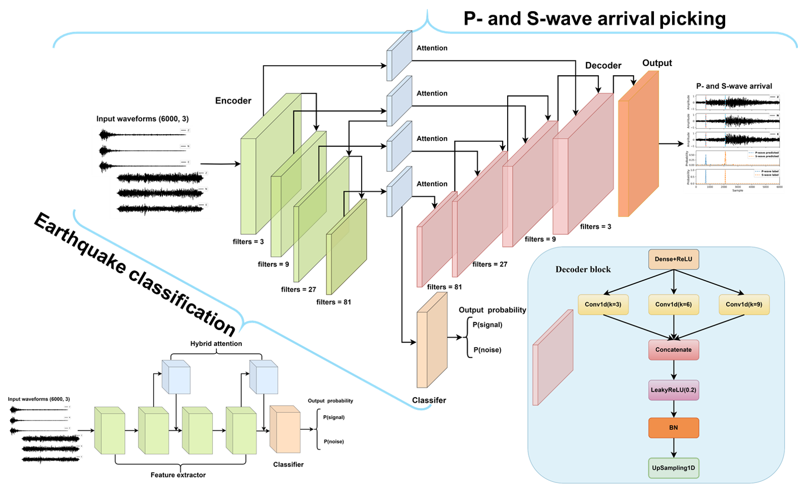

# Multi-task-EQDetection
\bold{Earthquake Signal Detection Using a Multi-Scale Feature Fusion Network with Hybrid Attention Mechanism}

Signal and noise classification can add an extra level of constraint for earthquake phase picking by pinpointing the signal waveforms from continuous seismic data for more accurate arrival picking. However, the continuously increasing data collected by worldwide stations exceeds the ability of manual analysis. Moreover, manual earthquake data analysis depends on seismologists' expert knowledge, resulting in inconsistent analysis results. To address this, we proposed a generalized deep learning (DL) network architecture to discriminate earthquake signal and noise waveforms. The proposed DL framework is a novel architecture comprising a feature extractor, a classifier, and two hybrid attention modules. It utilizes different kernel sizes for more detailed feature extraction, and the hybrid attention mechanism module can guide the network to focus more on the waveform characteristics. To illustrate the power of the proposed DL network, we applied it to classify the earthquake signal and noise of the 3-C Texas Earthquake Dataset (TXED). The results demonstrate that the accuracy of the proposed method in the testing set reaches 99.83\%. We further utilize the transfer learning strategy to demonstrate the transferability of the proposed network with the Stanford earthquake dataset, showing an encouraging classification accuracy of 95.03\%. Additionally, we conducted an additional experiment on arrival picking by integrating decoder blocks into the classification network, which achieves remarkable P- and S-wave arrival picking accuracy.

## The testing data
Due to the limitation of Github, please refer to the following link to download the testing data:  https://drive.google.com/drive/folders/14kaFvHdMTJc2XL7Wl498F17UmfaidEfx?usp=drive_link

After downloading the testing data and TXED, please put them into the "data" folder

## TXED data
In this package, we used an excellent open-source earthquake data for AI -- TXED, please refer to the following link for more details: https://github.com/chenyk1990/txed 

Addtionally, please use the following link to download the TXED: https://drive.google.com/drive/folders/1WXVB8ytNB4bOaZ97oq6OmMRyAEg95trp?usp=sharing

## Reference
    Cui Y., Bai M., Wu J., and Chen Y., “Earthquake Signal Detection Using a Multi-Scale Feature Fusion Network with Hybrid Attention Mechanism,” in revision.

BibTex

    @Article{EQdetection,
      author={Yang Cui and Min Bai and Juan Wu and Yangkang Chen},
      title = {Earthquake Signal Detection Using a Multi-Scale Feature Fusion Network with Hybrid Attention Mechanism},
      journal={TBD},
      year=2024,
      volume={TBD},
      issue={TBD},
      number={TBD},
      pages={TBD},
      doi={TBD},
    }

## Install 
For set up the environment and install the dependency packages, please run the following script:
    
    conda create -n mEQd python=3.11.7
    conda activate mEQd
    conda install ipython notebook
    pip install tensorflow==2.15.0, keras==2.15.0, h5py==3.10.0, scikit-learn==1.4.0, seaborn==0.13.2, matplotlib==3.8.4, scipy==1.11.4

If you want to run with GPUs, please run the following script to install the dependency package:

    conda create -n mEQd python=3.11.7
    conda activate mEQd
    conda install ipython notebook
    pip install tensorflow==2.15.0, keras==2.15.0, h5py==3.10.0, scikit-learn==1.4.0, seaborn==0.13.2, matplotlib==3.8.4, scipy==1.11.4
    conda install -c anaconda cudnn==8.2.1

## Development

    The development team welcomes voluntary contributions from any open-source enthusiast. 
    If you want to make contribution to this project, feel free to contact the development team. 
    
## Contact

    Regarding any questions, bugs, developments, collaborations, please contact  
    Yang Cui
    yang.cui512@gmail.com
